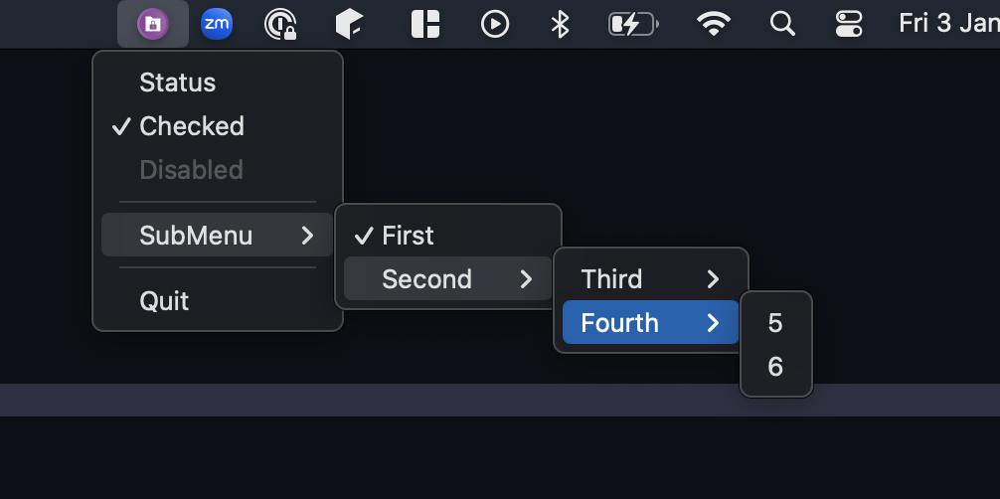

# System Tray in C3

### tray.c3
Create a system tray status bar with a menu, ported from [c](https://github.com/binRick/c_tray)

### window.c3
Example usage of the Objective-C Runtime through C3's objc bindings. 

An empty [window](window.c3) with events, ported from [c](https://github.com/ColleagueRiley/Cocoa-in-Pure-C)

## References
- ref https://github.com/ColleagueRiley/Cocoa-in-Pure-C
- ref https://github.com/binRick/c_tray
- https://developer.apple.com/documentation/objectivec/1456712-objc_msgsend
- https://github.com/c3lang/c3c/blob/master/lib/std/os/macos/objc.c3

