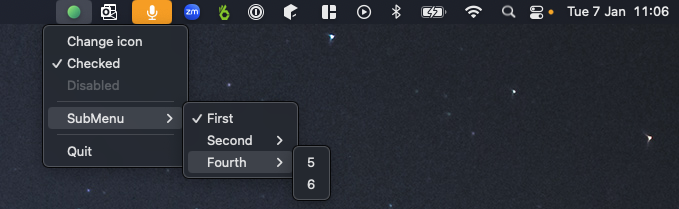

# System Tray in C3

### tray.c3
Create a system [tray](tray.c3) status bar with a menu

> c3c run tray

### window.c3
Example usage of the Objective-C Runtime through C3's objc bindings. 

An empty [window](window.c3) with events

> c3c run window

## References
- https://github.com/ColleagueRiley/Cocoa-in-Pure-C
- https://github.com/binRick/c_tray
- https://developer.apple.com/documentation/objectivec/1456712-objc_msgsend

